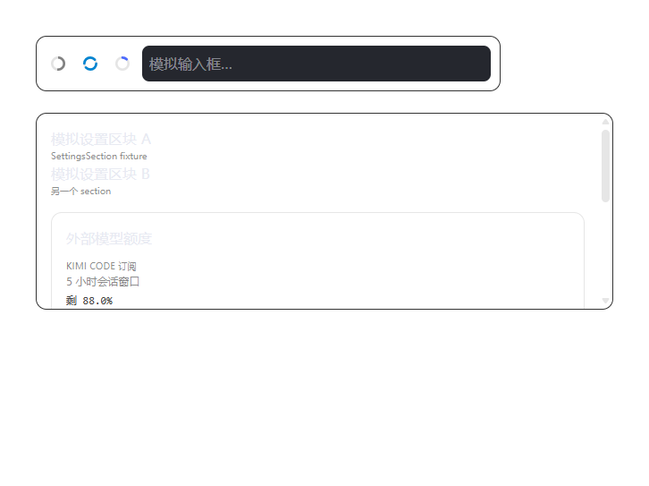

# ZCodeQuota

English | **[简体中文](README.md)**

Show your **Kimi Code subscription quota** and **DeepSeek API balance** directly inside the [ZCode](https://github.com/zai-org/ZCode) desktop app — rendered the same way ZCode already displays GLM coding-plan usage.



The UI lives in ZCode's **native spots**: an extra usage ring beside the context ring in the composer (hover to expand a panel), plus an "External model quota" card in Settings.

## Features

- 🔵 **Ring progress**: the ring fills with your Kimi 5-hour window usage (blue → amber at 60% → red at 85%). It borrows the GLM ring's visual language but its colors are fully pinned with inline styles, so GLM's own state styling (e.g. the green "reset opportunity" tint) never leaks in.
- 📊 **Hover panel**: Kimi monthly total / code-model monthly / 5-hour session window (percentage, remaining count, reset countdown), plus DeepSeek balances and availability.
- ⚙️ **Settings card**: the same data as a native-looking card in the Settings page.
- 🔄 **Auto refresh**: every 5 minutes; instant refresh when the panel opens or ↻ is clicked.
- 🛡️ **Installable & removable**: a single-file exe injector; uninstall restores the original `app.asar` byte-for-byte. After a ZCode auto-update, just run install again.

## Download & install

Grab `ZCodeQuotaInjector.exe` (~90 MB, embeds the Node runtime, zero dependencies) from [Releases](../../releases).

1. **Fully quit** ZCode (including the tray icon).
2. Double-click the exe → choose **1) Install** → approve the UAC prompt → press Enter in the child window when it finishes.
3. Start ZCode normally — the quota ring appears beside the context ring.

CLI usage: `install` / `uninstall` / `status` / `doctor` (first stop for troubleshooting; shows renderer and injector logs) / `version`. `uninstall --purge` also removes the backup and logs.

## How it works

A surgical patch to `resources/app.asar` (three one-line appends + three new files), never a full repack:

- `index.html` gets one `<script>` tag for the renderer UI; the preload tail gets an **inlined** bridge (sandbox-safe — only `require('electron')`); the main bundle's tail dynamically imports a hook that registers the `ipcMain` quota handler.
- The original data region is **preserved byte-for-byte**; modified/new content is appended, entry offsets relocated and SHA-256 integrity recomputed, self-checked, then atomically swapped in. The first install keeps a pristine backup.
- Native look: the ring button is cloned from the GLM trigger (public anchor `data-testid="chat-context-usage-trigger"`); panel rows replicate the open-source `ChatCodingPlanUsageMeter` structure using ZCode's own theme tokens (follows light/dark).
- **ZCode.exe itself is never modified** (no signature breakage). ZCode's embedded asar-integrity fuse was verified to be disabled.

Data path: renderer → preload bridge → main process → official endpoints (read-only GET):

| Provider | Endpoint | Notes |
| --- | --- | --- |
| Kimi Code subscription | `GET https://api.kimi.com/coding/v1/usages` | Same source as the open-source [kimi-cli](https://github.com/MoonshotAI/kimi-cli) `/usage`; requires an `sk-kimi-` subscription key |
| DeepSeek | `GET https://api.deepseek.com/user/balance` | [Official balance API](https://api-docs.deepseek.com/zh-cn/api/get-user-balance) |

## Security & privacy

- API keys are read only from the local ZCode provider config (`~/.zcode/v2/provider_config.json`) or the `KIMI_API_KEY` / `DEEPSEEK_API_KEY` environment variables. They live **only in the main process's memory** — never in the renderer, never on disk, never in logs.
- No network traffic other than the two read-only queries above. No telemetry.
- This repository contains no keys; secret-shaped-string scans are part of the pre-release checklist.

## Build & test

```bash
cd zquota-injector
node build-exe.mjs        # rebuild the exe (Node SEA + postject)
node test-patcher.mjs     # 21 safety checks on an asar copy (patch / official-tool cross-validation / byte-identical restore)
node fixture-test.mjs     # headless UI tests (real ZCode stylesheet + fixture DOM)
```

The repo also archives two earlier iterations: `plugins/model-quota/` (an official-style `/quota` command plugin) and `zcode-quota/` (a CDP floating-widget approach).

## Known limitations

- A ZCode auto-update replaces `app.asar` and wipes the patch — `status` flags the version change; run `install` again.
- Multiple windows each get their own copy of the UI. Antivirus heuristics may very rarely false-positive (the tool only appends asar content and never touches executables).
- Patching the ZCode install directory is an end-user decision, unrelated to the ZCode team. You can always `uninstall` to restore the original bytes.

## Acknowledgements

- [Llliao1113/zcode-plus](https://github.com/Llliao1113/zcode-plus) — CDP injection precedent (earlier iteration)
- [MoonshotAI/kimi-cli](https://github.com/MoonshotAI/kimi-cli) — source of the Kimi quota endpoint
- [zai-org/ZCode](https://github.com/zai-org/ZCode) — component structure reference

## License

[MIT](LICENSE)
